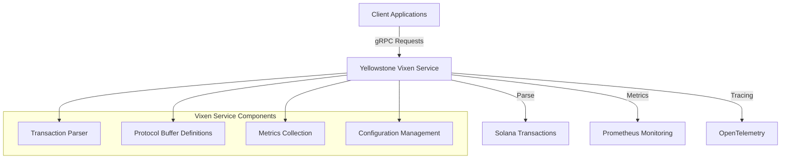
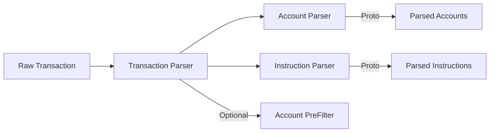
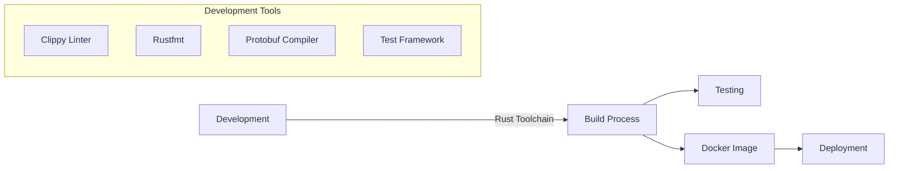

# Yellowstone Vixen - Project Overview

## Introduction
Yellowstone Vixen is a high-performance Rust-based project that provides a gRPC service for parsing Solana transactions. It's designed to work seamlessly with the Yellowstone ecosystem, offering efficient and reliable transaction parsing capabilities.

## Architecture Overview



## Key Components

### 1. gRPC Service
- Provides a high-performance interface for transaction parsing
- Uses Protocol Buffers for efficient data serialization
- Supports bi-directional streaming capabilities
- Configurable connection pooling and resource management

### 2. Parser System


### 3. Monitoring & Observability
- Prometheus integration for metrics
- OpenTelemetry support for distributed tracing
- Configurable logging levels
- Performance monitoring dashboards

## Technology Stack
- **Language**: Rust (nightly-2024-02-01)
- **Framework**: gRPC with Tonic
- **Serialization**: Protocol Buffers
- **Monitoring**: Prometheus & OpenTelemetry
- **Configuration**: TOML-based with dynamic reloading

## Development Environment


## Project Structure
```
yellowstone-vixen/
├── crates/                    # Workspace crates
│   ├── core/                  # Core types and traits
│   ├── parser/               # Transaction parsers
│   ├── proto/                # Protocol buffer definitions
│   └── test/                 # Testing utilities
├── docs/                     # Documentation
│   └── onboarding/          # Onboarding guides
├── examples/                 # Usage examples
└── scripts/                  # Development scripts
```

## Getting Started
For detailed setup instructions, see [Getting Started Guide](04-getting-started.md).