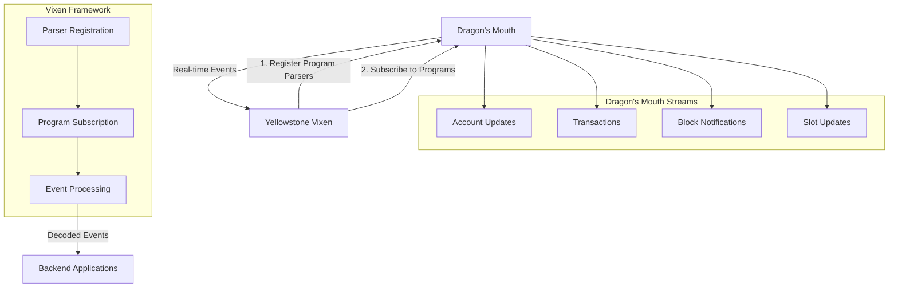
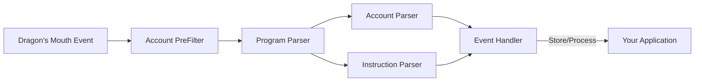

# Yellowstone Vixen - Project Overview

## Introduction
Yellowstone Vixen is a framework for building program-aware parsers that process Solana change events from [Dragon's Mouth](https://docs.triton.one/project-yellowstone/dragons-mouth-grpc-subscriptions), part of Project Yellowstone's high-performance blockchain data delivery infrastructure. It enables developers to create custom parsers that decode and process real-time blockchain events for specific Solana programs.

## Project Yellowstone Context
Yellowstone Vixen is part of Project Yellowstone, a suite of tools named after Yellowstone National Park's geysers:
- **Dragon's Mouth**: High-performance gRPC interface for streaming real-time blockchain data
- **Whirligig**: WebSocket interface for frontend applications
- **Steamboat**: Custom indexes for enhanced performance
- **Old Faithful**: Historical archive for transaction and block data

## How Vixen Works with Dragon's Mouth



## Key Components

### 1. Parser System


### 2. Program Parsers
- Transform raw Solana events into program-specific formats
- Support for parsing:
  - Account state changes
  - Instructions and transactions
  - Cross-program invocations (CPI)
- Filter capabilities to process only relevant events

### 3. Handler System
- Flexible event processing pipeline
- Database integration for event persistence
- Custom processing logic
- Real-time event handling

## Getting Started

### Prerequisites
1. Understanding of Solana programs and account structure
2. Access to Dragon's Mouth gRPC endpoint
3. Rust development environment

### Quick Start
1. Define your program parser:
   ```rust
   // Example parser implementation
   impl Parser for MyProgramParser {
       // Parse account updates
       fn parse_account(&self, account: AccountInfo) -> Result<ProgramAccount>;
       
       // Parse instructions
       fn parse_instruction(&self, ix: InstructionInfo) -> Result<ProgramInstruction>;
   }
   ```

2. Configure event handlers:
   ```rust
   // Example handler setup
   let handler = MyEventHandler::new()
       .with_database_connection(db_config)
       .with_custom_processing(process_fn);
   ```

3. Run Vixen with your parser:
   ```rust
   let vixen = VixenBuilder::new()
       .with_parser(my_program_parser)
       .with_handler(handler)
       .build()?;
   
   vixen.start().await?;
   ```

For detailed setup instructions and examples, see:
- [Technical Decisions](02-technical-decisions.md)
- [Getting Started Guide](03-getting-started.md)
- [Dragon's Mouth Documentation](https://docs.triton.one/project-yellowstone/dragons-mouth-grpc-subscriptions)