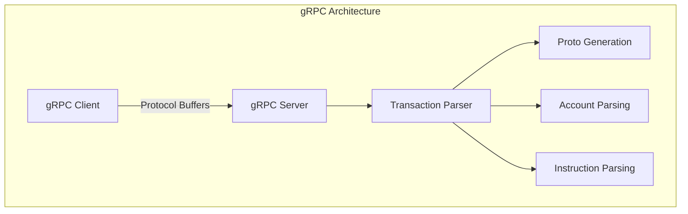
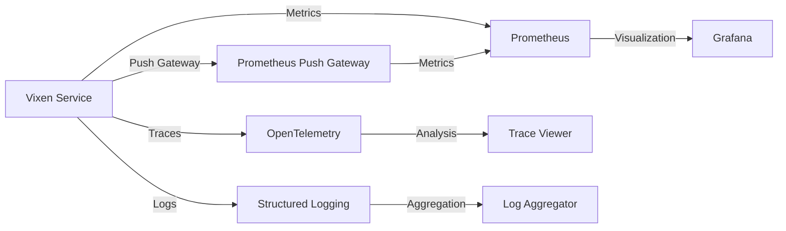
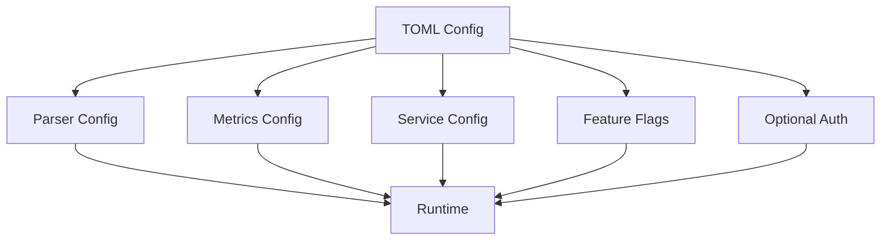
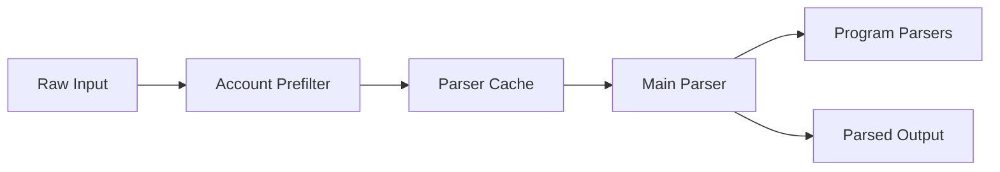

# Technical Decisions & Architecture

## Core Technical Decisions

### 1. Choice of Rust
- **Memory Safety**: Rust's ownership model ensures thread-safety and prevents memory-related bugs
- **Performance**: Zero-cost abstractions and minimal runtime overhead
- **Ecosystem**: Strong Solana ecosystem support and crypto-related libraries
- **Tooling**: Excellent development tools (rustfmt, clippy, cargo)

### 2. gRPC Implementation

**Benefits**:
- Strongly typed interface definitions
- Efficient binary serialization
- Bi-directional streaming support
- Language-agnostic client support
- High performance with Tonic implementation
- Truncated identifiers for better compatibility

### 3. Protocol Buffer Design
- Structured message definitions for transactions
- Versioned protocol support
- Efficient serialization/deserialization
- Support for both Orca and Raydium protocols
- Jupiter and Naga program parsers support

### 4. Monitoring Architecture

## Design Patterns

### 1. Parser Architecture
- Modular parser design with trait-based implementation
- Clear separation of concerns between parsing layers
- Extensible plugin system for new program parsers
- Efficient prefiltering mechanism
- Refactored parser system for better maintainability

### 2. Configuration Management

### 3. Error Handling
- Custom error types with detailed context
- Proper error propagation through async boundaries
- Structured logging for errors
- Graceful failure handling with recovery strategies
- Metric tracking for error rates
- Version conflict resolution strategies

## Security Considerations

### 1. Input Validation
- Strict validation of incoming requests
- Size limits on messages
- Rate limiting capabilities
- Protocol buffer validation
- Truncated gRPC identifiers for safety

### 2. Authentication & Authorization
- Optional username/password authentication
- Configurable security policies
- TLS support for secure communication
- Role-based access control
- API key management
- Flexible authentication configuration

## Performance Optimizations

### 1. Parsing Optimizations

### 2. Resource Management
- Efficient memory usage with pooling
- Connection pooling for gRPC
- Proper resource cleanup
- Configurable thread pools
- Backpressure handling
- Build flag optimizations

### 3. Testing Strategy
- Comprehensive unit test coverage
- Integration tests with mock data
- Performance benchmarks
- Fuzzing tests for parser
- Continuous integration pipeline
- Program-specific parser tests