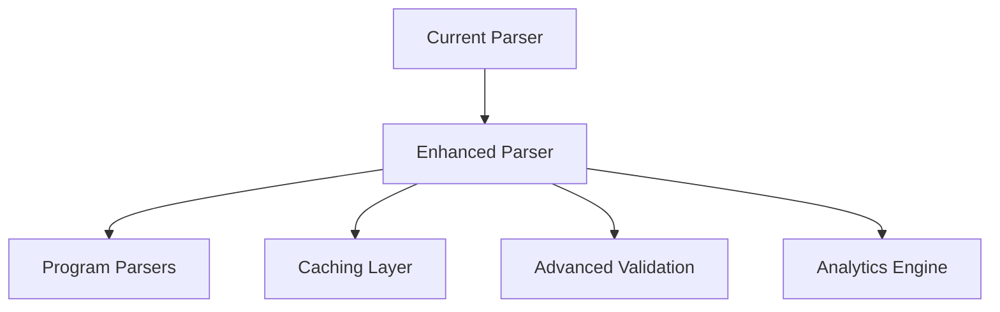
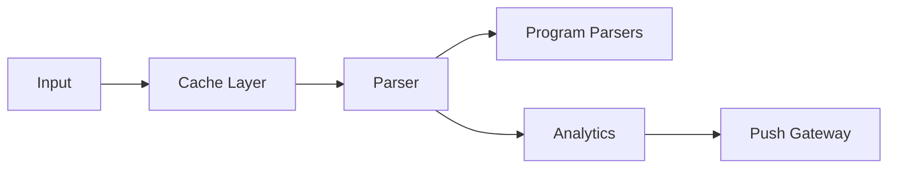
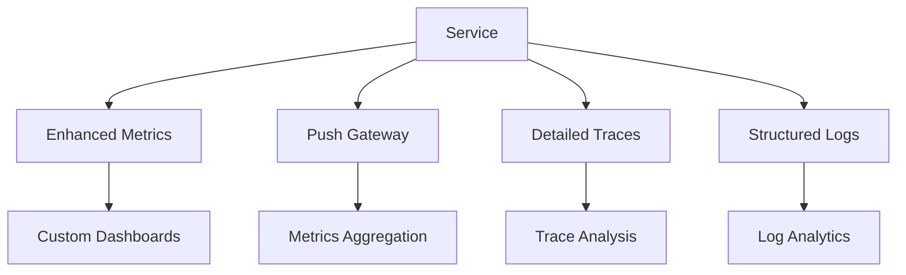

# Technical Debt & Future Improvements

## Current Technical Debt

### 1. Parser Implementation
- [x] Refactor parser system for better maintainability
- [x] Add Jupiter and Naga program parsers
- [ ] Optimize memory allocation in hot paths
- [ ] Improve error handling for edge cases
- [ ] Add more comprehensive validation for complex instructions

### 2. Performance Optimization
- [x] Add build flag optimizations
- [x] Implement Prometheus push gateway support
- [ ] Optimize protocol buffer serialization
- [ ] Add caching layer for frequently parsed transactions
- [ ] Profile and optimize memory usage patterns

### 3. Security & Configuration
- [x] Add optional username/password authentication
- [x] Implement truncated gRPC identifiers
- [ ] Enhance TLS configuration
- [ ] Implement rate limiting
- [ ] Add audit logging

## Roadmap 2025

### Q1 2025
- [ ] Enhanced program parser support
- [ ] Advanced authentication mechanisms
- [ ] Performance optimization phase 1
- [ ] Monitoring improvements

### Q2 2025
- [ ] Advanced caching system
- [ ] Metrics aggregation enhancements
- [ ] Documentation overhaul
- [ ] Security hardening

### Q3 2025
- [ ] Scalability improvements
- [ ] Additional program parsers
- [ ] Performance optimization phase 2
- [ ] Analytics platform integration

### Q4 2025
- [ ] Enterprise features
- [ ] Advanced security features
- [ ] Cloud-native improvements
- [ ] Performance optimization phase 3

## Improvement Proposals

### 1. Parser Enhancement


**Goals**:
- Support for all major Solana programs
- Improve parsing speed by 50%
- Reduce memory usage by 30%
- Add comprehensive validation

### 2. Performance Optimization


**Targets**:
- Sub-millisecond parsing time
- Optimal memory usage
- Efficient resource utilization
- Real-time metrics reporting

### 3. Monitoring Improvements


## Code Quality Improvements

### 1. Testing
- [x] Add program-specific parser tests
- [ ] Increase test coverage to 90%
- [ ] Add property-based testing
- [ ] Implement integration test suite
- [ ] Add performance regression tests

### 2. Documentation
- [x] Update parser documentation
- [ ] Improve API documentation
- [ ] Add more code examples
- [ ] Create video tutorials
- [ ] Add troubleshooting guides

### 3. Development Experience
- [x] Add build flag support
- [ ] Improve CI/CD pipeline
- [ ] Add development containers
- [ ] Enhance debugging tools
- [ ] Create development scripts

## Security Improvements

### 1. Authentication & Authorization
- [x] Implement optional authentication
- [ ] Add API key management
- [ ] Enhance TLS configuration
- [ ] Add audit logging
- [ ] Implement rate limiting

### 2. Input Validation
- [x] Implement truncated identifiers
- [ ] Enhance request validation
- [ ] Add input sanitization
- [ ] Implement request size limits
- [ ] Add protocol validation

## Maintenance Tasks

### 1. Dependencies
- [x] Fix version conflicts (zeroize)
- [ ] Update remaining dependencies
- [ ] Remove unused dependencies
- [ ] Document dependency decisions
- [ ] Create update strategy

### 2. Code Cleanup
- [x] Refactor parser implementation
- [ ] Remove deprecated code
- [ ] Fix compiler warnings
- [ ] Improve error messages
- [ ] Enhance logging
``` 